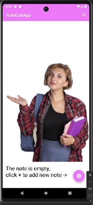
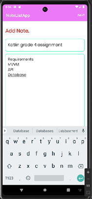
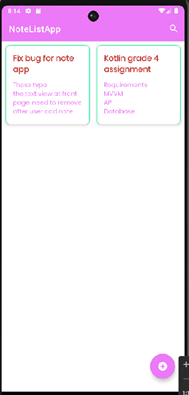
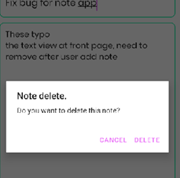

# NoteListApp

## Introduction
This is an Android application practice from OAMK. Using Android studio, java and kotiln.

## Technologies Used
- MVVM Architecture
- Room Database for local data storage
- Navigation Component for managing UI navigation
- LiveData for data observation

## Features
- Note- Users can add, edit, and delete notes by their own needed.
- Easy - navigation between the home screen and edit note screen, no need to swap to other screen.
- Empty - state screen with a prompt to add a new note if the note list is empty.
- Delete - Application will send notice to remind users if they really want to delete, in case mis-delete.

## Screenshots
Home Screen             |  Edit Note Screen
:-------------------------:|:-------------------------:
  |  

Note View Screen | Delete Note Confirmation
------------ | -------------
 | 

## Installation and Setup
To set up and use this project locally, follow these steps:
1. Clone the repository: `https://github.com/ofiscarlett/NoteListApp.git`
2. Open the project in Android Studio or Android phone and sync Gradle files
3. Run the app on your device or emulator

## Usage
- **Add a New Note**: Click on the `+` button to open the edit screen and save a new note.
- **Edit a Note**: Tap on a note from the list to edit its content.
- **Delete a Note**: Swipe a note left/right or select a note to reveal the delete option.

## Contributing
Appreciated Jukka Nevalainen kindly guide for first Mobile with Native Language task to complete this practice.
This is for the Mobile Programming with Native Technologies ID00CS48-3003 OAMK lecture paractice.

